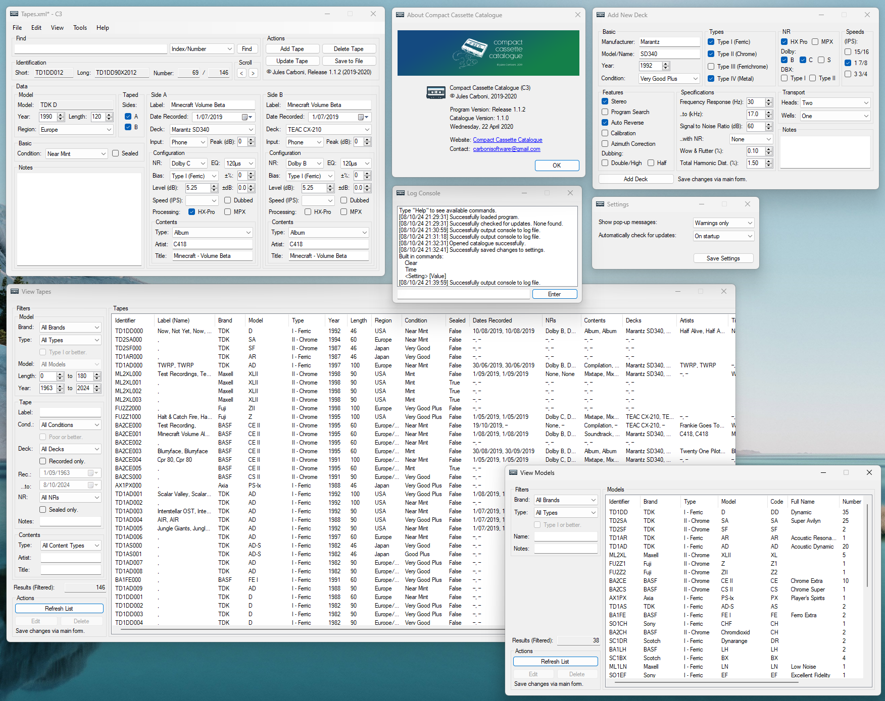

# Compact Cassette Catalogue

**Cataloguing application for home recorded compact cassette tapes.**

See [changes](CHANGELOG.md "C3 Changelog"), the [legacy maintenance workboard](TODO.md "C3 1.3 Workboard"), and the [wiki](https://github.com/Julesc013/compact-cassette-catalogue/wiki "C3 Wiki").

> **Repository status:** the available user release remains C3 1.2.0 Beta 1.
> `dev/1.x` now prepares the intentionally unpublished C3 1.3.0 Alpha 5
> Legacy Layout Stabilization checkpoint. Alpha 4 remains an immutable retained
> owner-test preview whose testing exposed overlap and runtime geometry defects.
> Alpha 5 preserves its workflows while restoring an original-simple source
> tree and measured native WinForms layout. Historical and exact target-machine
> evidence still block Beta promotion. See the
> [legacy maintenance documentation](docs/README.md).
> After Alpha, the owner ratified an exact three-lane stable matrix: x86/net40,
> x64/net48, and native ARM64/net481. The Alpha tag remains immutable historical
> evidence of its earlier four diagnostic lanes.
> The bounded three-lane build/package controls and native ARM64 binary proof
> pass. Alpha 5 tagging and local distribution retention are authorized only
> after its source, layout, accessibility, startup, package, and reproduction
> checks. No public release, minimum-OS qualification, feed change, Beta tag,
> or legacy-ledger promotion is implied.

## What is it?

*Compact Cassette Catalogue* (hereafter *C3*) allows you to build up a catalogue of your blank cassettes.
It is a **user friendly** and **feature rich** alternative to a database.

## Who is it for?

*C3* is intended for tapeheads who may be finding it **difficult to manage their large collection** of cassettes and need a system for **indexing, sorting and searching**.

I created *C3* for myself because:
1. I prefer *aesthetically minimal j-cards* which are often devoid of useful information...
Which Dolby did I use when I recorded this?
2. I find it handy to be able to open up a list view of all my blank tapes, filter for the brand, type and length I want, and easily *select the perfect tape* for my new mix.

Note: *C3* is not geared towards *pre-recorded* tapes ([Discogs](https://www.discogs.com/ "Discogs - Music Database and Marketplace") does that job exceptionally) though it is fully capable.

## Why is it better?

This program provides many helpful features such as:
- *Search functionality* to assist in navigating large catalogues.
- *List views* to browse catalogued items.
- *Data visualisations* to track changes to the catalogue.

Many pieces of information can be stored about each **tape**, such as:
- Manufacturer/Brand
- Model/Name
- Series year
- Length
- Type
- Region
- Condition

And much more information can be stored about the **recordings** on each side, including:
- Deck model
- Input type
- Peak level
- Noise reduction
- Speed
- Bias and EQ
- Contents

You can even **catalogue your tape decks** (including their specifications).

*Catalogues are stored locally as XML files for ease of use. Treat the catalogues like you would a Word document, for example.*

## How to get started.

Head over to the [releases page](https://github.com/Julesc013/compact-cassette-catalogue/releases "C3 Releases") and download the portable x86 build for the latest version.
(Look for *C3-vX.X.X-win-x86.exe* or *C3-vX.X.X-win-x86-portable.zip*.)

*Note: The x86/32-bit portable build is the compatibility build and **does not** require installing or administrator privileges.*

*Note: The x64 build is for 64-bit Windows only. Windows XP x64 support is unverified unless tested separately.*

*Note: C3 is offline-first. Catalogues are local XML files, update checking is optional, and automatic update checking is disabled by default.*

*Note: Online update checking may fail on some old Windows versions because GitHub HTTPS connections can require newer TLS support than the operating system provides. If that happens, open the releases page in a browser and download updates manually. See [this site](https://mohalogiciels.runasp.net/Tutorials/NetFrameworkTls.xht) for a potential quick fix.*

## Legacy maintenance status

C3 1.3.0 is the final planned release of the original VB.NET/WinForms program.
It develops from safe post-release tip `58a5b7d...`; its exact production genome
is frozen to package source `509c9ec...`, with `v1.2.0b1` as the qualified
release oracle. The later project-splitting refactor is not production ancestry.

- Alpha 1 froze the recovery doctrine, compatibility evidence, genome gate, and
  its then-current four-lane diagnostic scaffolding. It is source-only and
  unpublished.
- Alpha 2 completed the retained three-lane build/release-control proof.
- Alpha 3 was the internal implementation phase for original-application
  reliability and the repaired optional classic VB.NET setup/uninstall
  lifecycle; its uncreated tag/package wave is superseded.
- Alpha 4 retained that repository-complete scope for owner testing and exposed
  the inadequate absolute/runtime-anchor layout mechanism.
- Alpha 5 restores the original-simple three-project source tree, replaces the
  presentation geometry with role-appropriate native containers, and requires
  measured layout, accessibility, performance, startup, and owner visual proof.
- Beta 1 may project the accepted Alpha 5 source without new behaviour.
  Beta-labelled artifacts and tags require explicit human approval even after
  technical eligibility is established.
- Stable always publishes the qualified portable packages; classic setup is
  included only if its target-machine evidence is accepted.

The final stable original WinForms release is built from one source-identical
project as `win-x86-net40` (VS2017, XP SP3 minimum), `win-x64-net48` (VS2022,
Windows 7 SP1 minimum), and native `win-arm64-net481` (VS2026, Windows 11 RTM
ARM64 minimum with .NET Framework 4.8.1 installed). Portable ZIPs are canonical.
An optional offline, per-machine classic setup may consume those exact bytes;
no MSI, MSIX, ClickOnce publication, network bootstrapper, updater, or new
runtime-DLL graph is part of the release. See the
[ratified matrix](docs/governance/1.3.0-three-lane-matrix-2026-08-05.md) and
[Alpha 3 setup decision](docs/governance/1.3.0-alpha3-classic-setup-2026-08-05.md).

The existing DataSet catalogue format remains 1.1.0. No 1.3 milestone introduces
a new runtime dependency, production assembly, C# source, project split, or UI
redesign.

The final 1.x production source remains in the original application,
installer, and uninstaller project directories. The modular `src/` layout
belongs only to `dev/2.x`; Alpha 5 moves the one shared setup-source exception
under the Installer directory rather than leaving a hybrid repository.

The **documentation (wiki)** and **quick-start tutorial** can be read [here](https://github.com/Julesc013/compact-cassette-catalogue/wiki "C3 Wiki");
this will help you get started and explains every function of the software.
If you need to review the documentation, you can open it from the *Help* menu or by pressing *F1*.

## System requirements.

#### Minimum
- Windows XP SP3 or newer (32-bit or 64-bit).
- .NET Framework 4.0
- 32MB of RAM.
- 2MB of hard drive space.
#### Recommended
- 128MB of RAM.
- 100MB of hard drive space.

**Copyright (c) 2019-2026 Jules Carboni**
